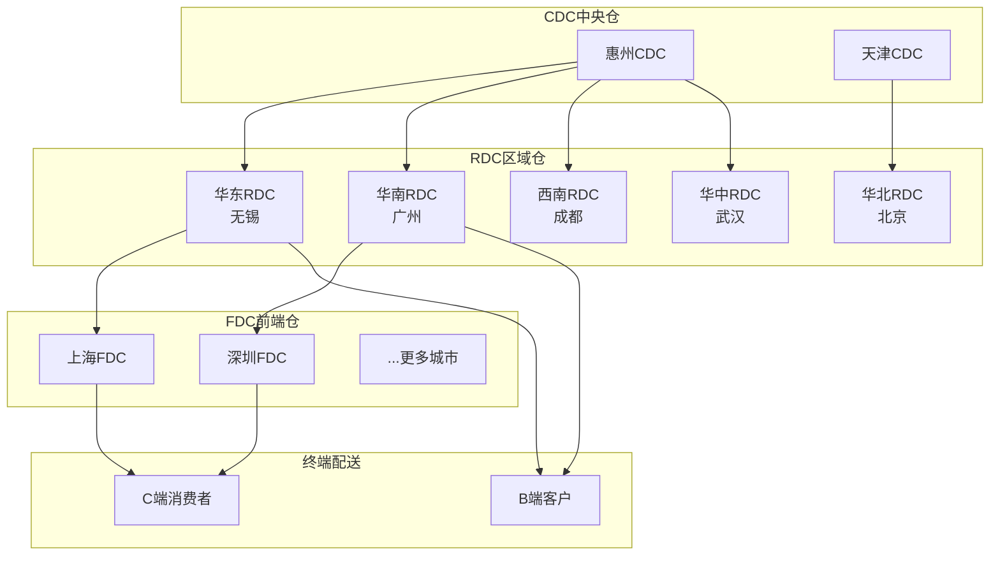
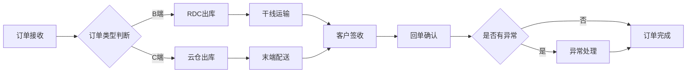
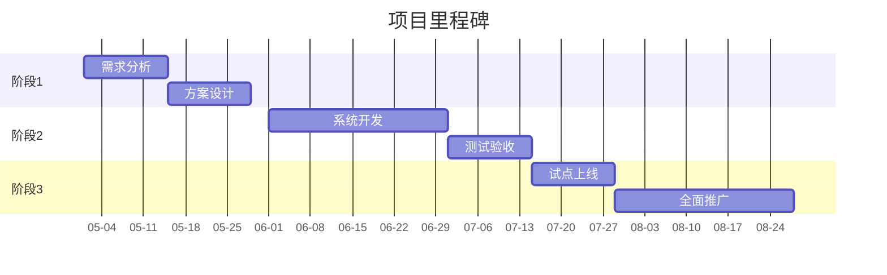
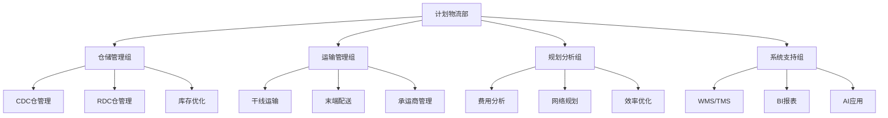
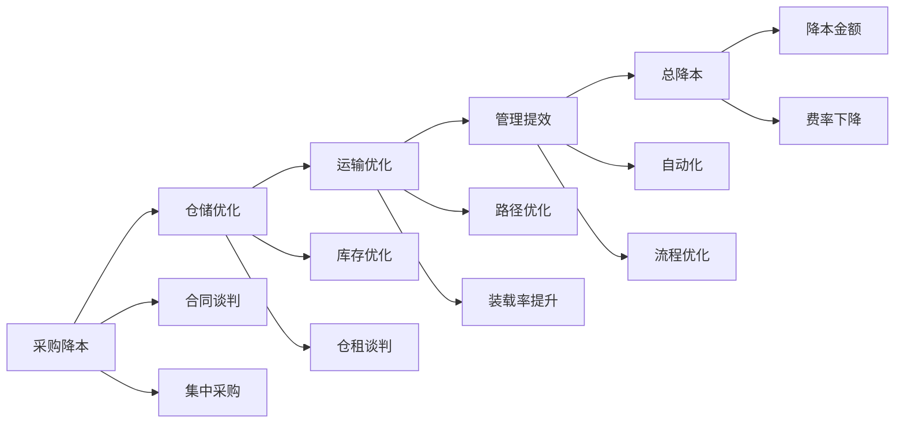

# Mermaid 图模板库

> 用于流程图、架构图、时序图等文本型图表

---

## 1. 根因分析三层穿透

**模板：**

```mermaid
flowchart TD
    A[现象层<br/>{现象描述}] --> B[机制层<br/>{机制描述}]
    B --> C[系统层<br/>{系统描述}]
    
    A -->|表现| A1[{数据点1}]
    A -->|影响| A2[{影响范围}]
    
    B -->|因素1| B1[{因素1数据}]
    B -->|因素2| B2[{因素2数据}]
    B -->|因素3| B3[{因素3数据}]
    
    C -->|组织| C1[{组织问题}]
    C -->|流程| C2[{流程问题}]
    C -->|系统| C3[{系统问题}]
```

**适用场景：** 根因分析页、问题诊断页

---

## 2. 仓网架构图

**模板：**



**适用场景：** 仓网规划页、系统规划页

---

## 3. 业务流程图

**模板（订单履约流程）：**



**适用场景：** 流程优化页、运营分析页

---

## 4. 项目里程碑时序图

**模板：**



**适用场景：** 项目进展页、规划页

---

## 5. 组织架构图

**模板：**



**适用场景：** 组织调整页、团队介绍页

---

## 6. 价值链图

**模板（降本价值链）：**



**适用场景：** 降本成果页、效率提升页
