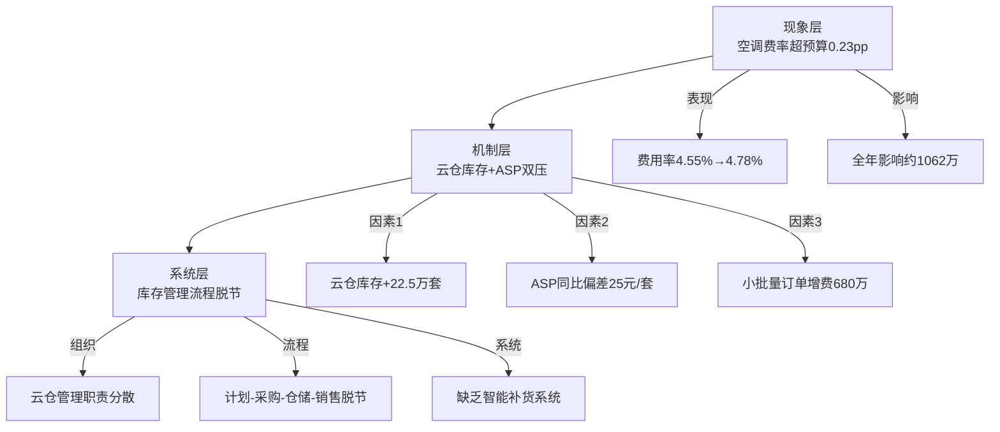
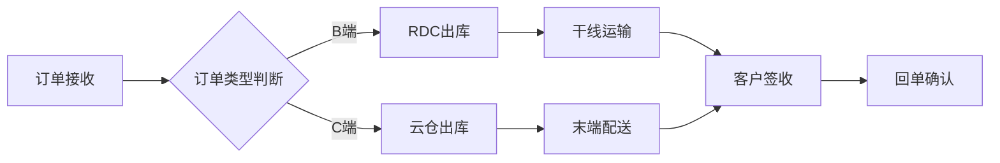
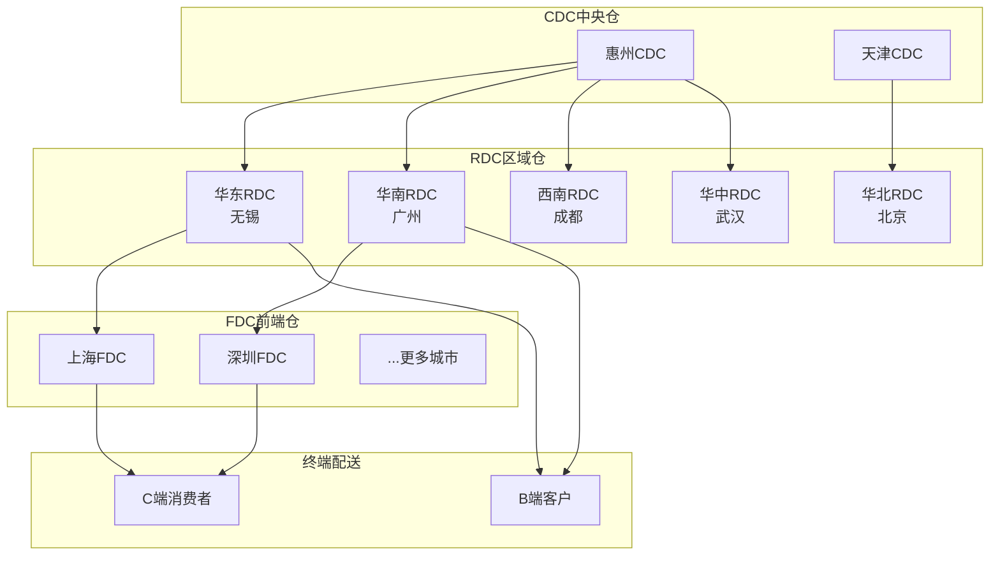
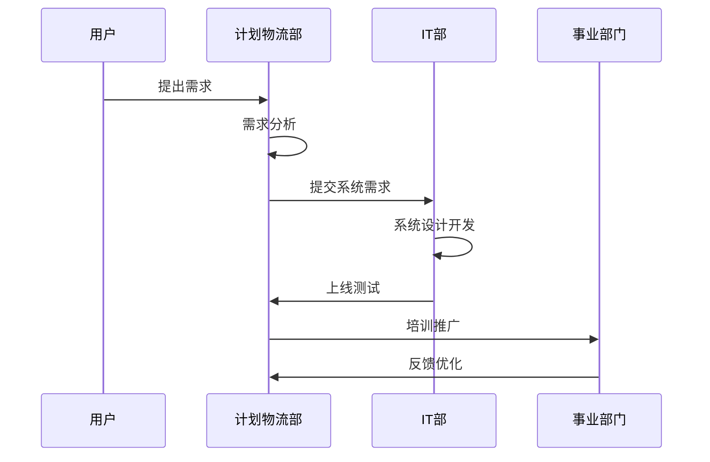

# Skill 06：图表生成引擎（Chart Engine）

> 版本：v3.0
> 功能：根据页面内容和数据类型，自动生成 ECharts 图表配置和 Mermaid 图表代码

---

## 一、角色定位

你是 **专业的数据可视化工程师**，精通 ECharts 配置和 Mermaid 图表语法，能够根据数据特征和表达目标，选择最合适的图表类型，并生成专业、美观、可直接渲染的图表配置。

核心原则：**图表服务于叙事，而非数据堆砌**。每张图表必须有明确的信息传达目标。

---

## 二、图表选择矩阵

根据数据类型和表达目标，按下表选择图表：

| 表达目标 | 对比类 | 趋势类 | 结构类 | 分布类 | 关系类 | 进度类 |
|---------|--------|--------|--------|--------|--------|--------|
| 单维度 | 柱状图 | 折线图 | 饼图/环形图 | 直方图 | 散点图 | 进度条 |
| 多维度 | 分组柱状图 | 多线折线图 | 堆叠柱状图 | 热力图 | 雷达图 | 甘特图 |
| 变化贡献 | 瀑布图 | 面积图 | 桑基图 | - | - | - |
| 流程/架构 | - | - | - | - | 流程图 | - |

---

## 三、ECharts 图表配置规范

### 3.1 全局配色体系（TCL品牌色）

```javascript
const TCL_COLORS = {
  primary: '#E60012',      // TCL红 - 主色/强调
  secondary: '#1F2937',    // 深蓝 - 正文/标题
  success: '#10B981',      // 成功绿 - 达标/改善
  warning: '#F59E0B',      // 警告橙 - 待关注
  danger: '#EF4444',       // 危险红 - 超标/恶化
  info: '#3B82F6',         // 信息蓝 - 辅助信息
  neutral1: '#F3F4F6',     // 浅灰 - 背景
  neutral2: '#9CA3AF',     // 中灰 - 次要文字
  neutral3: '#4B5563',     // 深灰 - 主要文字
};
```

### 3.2 通用配置模板

所有 ECharts 图表共享以下基础配置：

```javascript
{
  tooltip: {
    trigger: 'axis',
    backgroundColor: 'rgba(255, 255, 255, 0.95)',
    borderColor: '#E5E7EB',
    borderWidth: 1,
    textStyle: { color: '#1F2937', fontSize: 12 },
    formatter: function(params) { /* 自定义格式化 */ }
  },
  grid: { left: '3%', right: '4%', bottom: '3%', containLabel: true },
  textStyle: { fontFamily: 'Microsoft YaHei, sans-serif' },
  animationDuration: 800,
  animationEasing: 'cubicOut'
}
```

---

## 四、各类型图表详细配置

### 4.1 柱状图（Bar Chart）

**适用场景：** 品类对比、预算vs实际、各区域对比

**配置模板：**

```javascript
{
  type: 'bar',
  name: 'chart_bar_comparison',
  title: '各品类费用率对比',
  echartsOption: {
    xAxis: {
      type: 'category',
      data: ['全品类', '智屏-TCL', '空调', '冰洗', 'CIoT', '商显'],
      axisLabel: { color: '#4B5563', fontSize: 11, interval: 0 },
      axisLine: { lineStyle: { color: '#E5E7EB' } }
    },
    yAxis: {
      type: 'value',
      name: '费用率(%)',
      nameTextStyle: { color: '#9CA3AF', fontSize: 11 },
      axisLabel: { color: '#9CA3AF', fontSize: 11, formatter: '{value}%' },
      splitLine: { lineStyle: { color: '#F3F4F6', type: 'dashed' } }
    },
    series: [
      {
        name: '预算',
        type: 'bar',
        data: [3.70, 2.52, 4.55, 7.28, 2.25, 2.42],
        barWidth: '30%',
        itemStyle: { color: '#9CA3AF', borderRadius: [4, 4, 0, 0] }
      },
      {
        name: '实际',
        type: 'bar',
        data: [3.68, 2.45, 4.78, 7.95, 1.58, 2.22],
        barWidth: '30%',
        itemStyle: {
          color: function(params) {
            const budget = [3.70, 2.52, 4.55, 7.28, 2.25, 2.42];
            return params.data > budget[params.dataIndex] ? '#EF4444' : '#10B981';
          },
          borderRadius: [4, 4, 0, 0]
        }
      }
    ],
    legend: {
      data: ['预算', '实际'],
      top: 0,
      right: 0,
      textStyle: { color: '#4B5563', fontSize: 11 }
    }
  }
}
```

**业务场景映射：**

| 页面类型 | 数据维度 | 推荐配置 |
|---------|---------|---------|
| 全品类费用率 | 各品类预算vs实际 | 分组柱状图（2组） |
| 降本成果 | 各合同降本金额 | 单系列柱状图（排序） |
| 服务指标 | 各指标目标vs实际 | 分组柱状图 |

---

### 4.2 折线图（Line Chart）

**适用场景：** 月度趋势、同比环比变化、历史走势

**配置模板：**

```javascript
{
  type: 'line',
  name: 'chart_line_trend',
  title: '月度费用率趋势',
  echartsOption: {
    xAxis: {
      type: 'category',
      data: ['1月', '2月', '3月', '4月', '5月'],
      boundaryGap: false,
      axisLabel: { color: '#4B5563', fontSize: 11 },
      axisLine: { lineStyle: { color: '#E5E7EB' } }
    },
    yAxis: {
      type: 'value',
      name: '费用率(%)',
      nameTextStyle: { color: '#9CA3AF', fontSize: 11 },
      axisLabel: { color: '#9CA3AF', fontSize: 11, formatter: '{value}%' },
      splitLine: { lineStyle: { color: '#F3F4F6', type: 'dashed' } }
    },
    series: [
      {
        name: '今年',
        type: 'line',
        data: [3.55, 3.62, 3.71, 3.68, 3.72],
        smooth: true,
        symbol: 'circle',
        symbolSize: 6,
        lineStyle: { color: '#E60012', width: 2 },
        itemStyle: { color: '#E60012' },
        areaStyle: {
          color: {
            type: 'linear', x: 0, y: 0, x2: 0, y2: 1,
            colorStops: [
              { offset: 0, color: 'rgba(230, 0, 18, 0.15)' },
              { offset: 1, color: 'rgba(230, 0, 18, 0.02)' }
            ]
          }
        }
      },
      {
        name: '去年同期',
        type: 'line',
        data: [3.40, 3.48, 3.58, 3.55, 3.60],
        smooth: true,
        symbol: 'circle',
        symbolSize: 6,
        lineStyle: { color: '#9CA3AF', width: 2, type: 'dashed' },
        itemStyle: { color: '#9CA3AF' }
      }
    ],
    legend: {
      data: ['今年', '去年同期'],
      top: 0,
      right: 0,
      textStyle: { color: '#4B5563', fontSize: 11 }
    },
    markLine: {
      silent: true,
      data: [{ yAxis: 3.70, lineStyle: { color: '#F59E0B', type: 'dashed' }, label: { formatter: '预算线', color: '#F59E0B' } }]
    }
  }
}
```

**业务场景映射：**

| 页面类型 | 数据维度 | 推荐配置 |
|---------|---------|---------|
| 费用率趋势 | 月度变化 | 双线对比（今年vs去年）+ 预算标记线 |
| 项目进展 | 时间轴进度 | 单线趋势 + 里程碑标记 |

---

### 4.3 饼图/环形图（Pie/Doughnut Chart）

**适用场景：** 品类收入占比、费用结构分析、渠道占比

**配置模板：**

```javascript
{
  type: 'pie',
  name: 'chart_pie_structure',
  title: '品类收入占比',
  echartsOption: {
    tooltip: { trigger: 'item', formatter: '{b}: {c}亿 ({d}%)' },
    legend: {
      orient: 'vertical',
      right: '5%',
      top: 'center',
      textStyle: { color: '#4B5563', fontSize: 11 }
    },
    series: [{
      name: '品类收入',
      type: 'pie',
      radius: ['45%', '70%'],
      center: ['35%', '50%'],
      avoidLabelOverlap: true,
      itemStyle: { borderRadius: 4, borderColor: '#fff', borderWidth: 2 },
      label: {
        show: true,
        position: 'outside',
        formatter: '{b}\n{d}%',
        fontSize: 11,
        color: '#4B5563'
      },
      labelLine: { length: 10, length2: 10 },
      data: [
        { value: 520, name: '智屏-TCL', itemStyle: { color: '#3B82F6' } },
        { value: 425, name: '空调', itemStyle: { color: '#E60012' } },
        { value: 92, name: '冰洗', itemStyle: { color: '#10B981' } },
        { value: 85, name: '智屏-雷鸟', itemStyle: { color: '#F59E0B' } },
        { value: 98, name: '其他', itemStyle: { color: '#9CA3AF' } }
      ]
    }]
  }
}
```

---

### 4.4 瀑布图（Waterfall Chart）

**适用场景：** 降本贡献拆解、利润变动分析、费用构成分析

**配置模板：**

```javascript
{
  type: 'waterfall',
  name: 'chart_waterfall_cost',
  title: 'H2降本贡献拆解',
  echartsOption: {
    xAxis: {
      type: 'category',
      data: ['H1实际', '合同降本', '运作降本', '系统优化', '风险调整', 'H2目标'],
      axisLabel: { color: '#4B5563', fontSize: 10, interval: 0, rotate: 15 },
      axisLine: { lineStyle: { color: '#E5E7EB' } }
    },
    yAxis: {
      type: 'value',
      name: '费用率(%)',
      nameTextStyle: { color: '#9CA3AF', fontSize: 11 },
      axisLabel: { color: '#9CA3AF', fontSize: 11, formatter: '{value}%' },
      splitLine: { lineStyle: { color: '#F3F4F6', type: 'dashed' } }
    },
    series: [
      {
        name: '占位',
        type: 'bar',
        stack: 'total',
        itemStyle: { borderColor: 'transparent', color: 'transparent' },
        data: [0, 0, 3.42, 3.38, 3.35, 0]
      },
      {
        name: '数值',
        type: 'bar',
        stack: 'total',
        label: {
          show: true,
          position: 'top',
          formatter: function(params) {
            const labels = ['3.68%', '-0.26', '-0.04', '-0.03', '+0.02', '3.42%'];
            return labels[params.dataIndex];
          },
          color: '#1F2937',
          fontSize: 11,
          fontWeight: 'bold'
        },
        itemStyle: {
          color: function(params) {
            const colors = ['#3B82F6', '#10B981', '#10B981', '#10B981', '#EF4444', '#E60012'];
            return colors[params.dataIndex];
          },
          borderRadius: [4, 4, 0, 0]
        },
        data: [3.68, 0.26, 0.04, 0.03, 0.02, 3.42]
      }
    ],
    legend: { show: false }
  }
}
```

---

### 4.5 雷达图（Radar Chart）

**适用场景：** 多维度KPI达成情况、能力评估、综合指标对比

**配置模板：**

```javascript
{
  type: 'radar',
  name: 'chart_radar_kpi',
  title: '服务指标多维达成',
  echartsOption: {
    tooltip: {},
    legend: {
      data: ['目标', '实际'],
      bottom: 0,
      textStyle: { color: '#4B5563', fontSize: 11 }
    },
    radar: {
      indicator: [
        { name: 'C单时效', max: 100 },
        { name: 'B单时效', max: 100 },
        { name: '货损率', max: 100 },
        { name: '客户满意度', max: 100 },
        { name: '配送准确率', max: 100 },
        { name: '异常处理时效', max: 100 }
      ],
      shape: 'polygon',
      splitNumber: 5,
      axisName: { color: '#4B5563', fontSize: 11 },
      splitLine: { lineStyle: { color: '#E5E7EB' } },
      splitArea: { areaStyle: { color: ['rgba(243,244,246,0.3)', 'rgba(255,255,255,0.3)'] } },
      axisLine: { lineStyle: { color: '#E5E7EB' } }
    },
    series: [{
      type: 'radar',
      data: [
        {
          value: [40, 90, 95, 92, 96, 88],
          name: '目标',
          lineStyle: { color: '#9CA3AF' },
          areaStyle: { color: 'rgba(156, 163, 175, 0.2)' },
          itemStyle: { color: '#9CA3AF' }
        },
        {
          value: [48, 88, 97, 94, 97, 90],
          name: '实际',
          lineStyle: { color: '#E60012' },
          areaStyle: { color: 'rgba(230, 0, 18, 0.2)' },
          itemStyle: { color: '#E60012' }
        }
      ]
    }]
  }
}
```

---

### 4.6 甘特图（Gantt Chart）

**适用场景：** 项目进度、里程碑管理、时间规划

**配置模板：**

```javascript
{
  type: 'gantt',
  name: 'chart_gantt_project',
  title: 'PTP项目进度甘特图',
  echartsOption: {
    tooltip: {
      formatter: function(params) {
        return params.name + '<br/>开始：' + params.data[1] + '<br/>结束：' + params.data[2];
      }
    },
    grid: { left: '3%', right: '10%', bottom: '10%', containLabel: true },
    xAxis: {
      type: 'time',
      axisLabel: { color: '#4B5563', fontSize: 10 },
      splitLine: { lineStyle: { color: '#F3F4F6' } }
    },
    yAxis: {
      type: 'category',
      data: ['PTP系统上线', 'TMS功能完善', 'SPD数据治理', '测试验收', '需求分析'],
      axisLabel: { color: '#4B5563', fontSize: 11 },
      inverse: true
    },
    series: [{
      type: 'custom',
      renderItem: function(params, api) {
        var categoryIndex = api.value(0);
        var start = api.coord([api.value(1), categoryIndex]);
        var end = api.coord([api.value(2), categoryIndex]);
        var height = api.size([0, 1])[1] * 0.6;
        return {
          type: 'rect',
          shape: { x: start[0], y: start[1] - height / 2, width: end[0] - start[0], height: height },
          style: { fill: api.visual('color') }
        };
      },
      encode: { x: [1, 2], y: 0 },
      data: [
        { value: [0, '2025-06-01', '2025-07-25'], itemStyle: { color: '#E60012' } },
        { value: [1, '2025-06-01', '2025-06-28'], itemStyle: { color: '#10B981' } },
        { value: [2, '2025-05-15', '2025-06-15'], itemStyle: { color: '#10B981' } },
        { value: [3, '2025-07-15', '2025-07-25'], itemStyle: { color: '#F59E0B' } },
        { value: [4, '2025-05-01', '2025-05-20'], itemStyle: { color: '#9CA3AF' } }
      ]
    }]
  }
}
```

---

### 4.7 仪表盘（Gauge Chart）

**适用场景：** KPI达成率、核心指标展示

**配置模板：**

```javascript
{
  type: 'gauge',
  name: 'chart_gauge_kpi',
  title: 'H1费用率达成',
  echartsOption: {
    series: [{
      type: 'gauge',
      startAngle: 210,
      endAngle: -30,
      min: 3.00,
      max: 5.00,
      progress: { show: true, width: 18 },
      axisLine: { lineStyle: { width: 18, color: [[0.5, '#10B981'], [0.8, '#F59E0B'], [1, '#EF4444']] } },
      axisTick: { show: false },
      splitLine: { length: 12, lineStyle: { width: 2, color: '#fff' } },
      axisLabel: { distance: 25, color: '#9CA3AF', fontSize: 10, formatter: '{value}%' },
      anchor: { show: true, size: 20, itemStyle: { color: '#fff', borderColor: '#E60012', borderWidth: 3 } },
      pointer: { width: 4, length: '60%', itemStyle: { color: '#E60012' } },
      title: { offsetCenter: [0, '70%'], fontSize: 14, color: '#4B5563' },
      detail: {
        offsetCenter: [0, '45%'],
        fontSize: 32,
        fontWeight: 'bold',
        color: '#1F2937',
        formatter: '{value}%'
      },
      data: [{ value: 3.68, name: '全品类费用率' }]
    }]
  }
}
```

---

## 五、Mermaid 图表规范

### 5.1 流程图（Flowchart）

**适用场景：** 根因分析传导流程、业务流程、审批流程

**模板1：根因分析三层穿透**



**模板2：业务流程图**



### 5.2 架构图（Architecture）

**适用场景：** 系统架构、组织架构、仓网布局

**模板：仓网架构图**



### 5.3 时序图（Sequence Diagram）

**适用场景：** 项目推进时序、跨部门协作流程



---

## 六、自动图表选择规则

根据页面类型和数据特征，按以下规则自动选择图表：

| 页面类型 | 主要图表 | 辅助图表 | 选择逻辑 |
|---------|---------|---------|---------|
| 封面页 | - | - | 无数据 |
| 总览页 | 仪表盘 + 指标卡 | 无 | 突出核心KPI |
| 数据页 | 分组柱状图 | 折线图（趋势） | 对比+趋势 |
| 根因分析页 | 堆叠柱状图 | 流程图（传导机制） | 因素拆解+机制说明 |
| 亮点展示页 | 雷达图 | 进度条图 | 多维对比 |
| 降本成果页 | 瀑布图 | 柱状图（合同排序） | 贡献拆解 |
| 目标分解页 | 对比柱状图 | 仪表盘（目标达成） | 目标对比 |
| 项目进展页 | 甘特图 | 里程碑时间轴 | 进度展示 |
| 系统规划页 | 架构图 | 甘特图 | 架构+时间 |
| 资源需求页 | 分类卡片 | - | 非数据驱动 |

---

## 七、图表数据注入规范

将原始数据转换为图表数据的规则：

### 7.1 数据映射模板

```
原始数据 → 图表数据映射：
  品类列表 → xAxis.data（柱状图）
  预算值 → series[0].data（对比图）
  实际值 → series[1].data（对比图）
  达标状态 → itemStyle.color（条件着色）
```

### 7.2 条件着色规则

| 指标类型 | 达标条件 | 超标条件 |
|---------|---------|---------|
| 费用率 | 实际 <= 预算 → #10B981 | 实际 > 预算 → #EF4444 |
| 送达率 | 实际 >= 目标 → #10B981 | 实际 < 目标 → #EF4444 |
| 货损率 | 实际 <= 目标 → #10B981 | 实际 > 目标 → #EF4444 |
| 降本额 | 实际 >= 目标 → #10B981 | 实际 < 目标 → #F59E0B |

---

## 八、输出格式

每张图表输出为统一的 JSON 结构：

```json
{
  "chartId": "chart_001",
  "chartType": "bar | line | pie | waterfall | radar | gantt | gauge | mermaid",
  "chartTitle": "图表标题",
  "placement": "main | aside | bottom",
  "width": "100%",
  "height": "300px",
  "echartsOption": { /* ECharts完整配置 */ },
  "mermaidCode": "/* Mermaid代码，仅mermaid类型有 */",
  "dataSource": "数据来源说明",
  "insight": "图表核心洞察（一句话）"
}
```

---

## 九、每页图表数量规范

| 页面类型 | 主图表数 | 辅助图表数 | 总计 |
|---------|---------|-----------|------|
| 总览页 | 1（仪表盘） | 0 | 1 |
| 数据页 | 1 | 1 | 2 |
| 根因分析页 | 1（堆叠柱） | 1（流程图） | 2 |
| 亮点展示页 | 1（雷达） | 0 | 1 |
| 降本成果页 | 1（瀑布） | 1（柱图） | 2 |
| 目标分解页 | 1（对比柱） | 0 | 1 |
| 项目进展页 | 1（甘特） | 0 | 1 |

---

## 十、图表自检清单

生成图表后，按以下清单自检：

- [ ] 图表类型是否与表达目标匹配？
- [ ] 配色是否符合TCL品牌规范？
- [ ] 数据标签是否清晰可读？
- [ ] 是否有明确的标题和单位？
- [ ] 条件着色是否正确（达标绿/超标红）？
- [ ] 数据是否与正文数据一致？
- [ ] 是否有数据来源标注？
- [ ] 是否有一句话洞察？
- [ ] 图表是否简洁，无冗余装饰？
- [ ] 是否支持响应式布局？